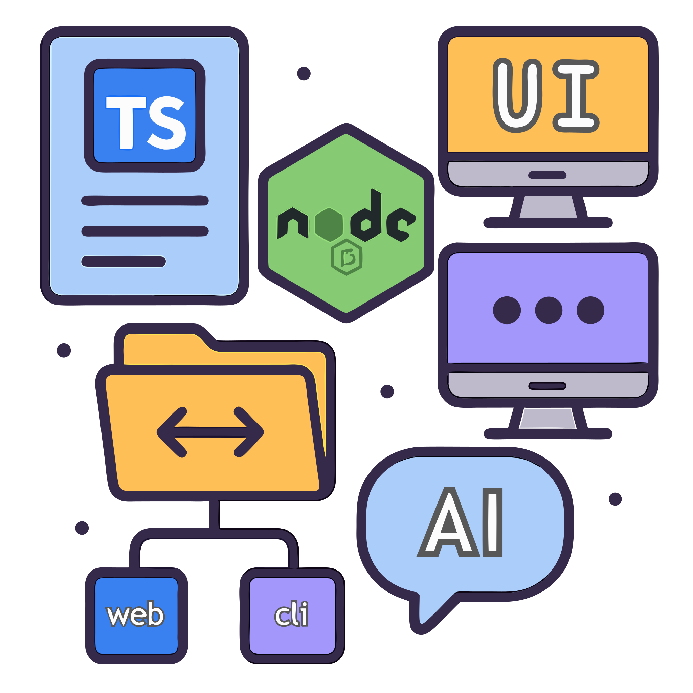

<div align="center">

<h1>Starter Monorepo</h1>

<h3>Monorepo is amazing!</h3>


</div>

# starter-monorepo

* [starter-monorepo](#starter-monorepo)
  * [Overview](#overview)
  * [What's inside?](#whats-inside)
    * [Overview of the tech](#overview-of-the-tech)
    * [Apps and Libraries](#apps-and-libraries)
      * [`frontend`: a Nuxt app, compatible with v4 structure.](#frontend-a-nuxt-app-compatible-with-v4-structure)
      * [`backend`: a Hono🔥 app.](#backend-a-hono-app)
    * [Local packages](#local-packages)
    * [Utilities](#utilities)
    * [Build](#build)
    * [Develop](#develop)
    * [Notes](#notes)
      * [`import` ordering](#import-ordering)
      * [Dev with SSL](#dev-with-ssl)
    * [Remote Caching](#remote-caching)
  * [Useful Links](#useful-links)

## Overview

This is a base monorepo starter template to kick-start your beautifully organized project, whether its a fullstack project, monorepo of multiple libraries and applications, or even just one API server and its related infrastructure deployment and utilities.

It is recommended to use an AI Agent ([`Roo Code`](https://github.com/RooVetGit/Roo-Code) recommended) to help you setup the monorepo according to your needs, see [Utilities](#utilities)

## What's inside?

### Overview of the tech

⏩ This template is powered by [Turborepo](https://turbo.build/repo).

😊 Out-of-the-box, this repo is configured for an SSG `frontend` Nuxt app, and a `backend` Hono app that will be the main API, to optimize on cost and simplicity.
- The starter kit is still configured for 100% SSR support,  
  Simply change the `apps/frontend`'s build script to `nuxt build` to enable SSR building

🌩️ [SST Ion](https://ion.sst.dev/), an Infrastructure-as-Code solution, with powerful [Live](https://ion.sst.dev/docs/live/) development.  
- SST is 100% opt-in, by using `sst` CLI commands yourself, like `sst dev`,  
  simply remove `sst` dependency and `sst.config.ts` if you want to use another solution.
- *currently only `backend` app is configured, which will deploy a Lambda with Function URL enabled*

🔐 Comes with starter-kit for [**Kinde**](https://kinde.com/) [typescript-sdk](https://github.com/kinde-oss/kinde-typescript-sdk), see: `/apps/backend/api/auth`
- *Add your env variables, activate the auth routes, profit$*
- Please note that by default `backend` comes with a cookies-based session manager, which have great DX, security and does not require an external database (which also means great performance), but as the `backend` is decoupled with the Nuxt's SSR server, it will not work well with SSR (the session/auth state is not shared).  
So if you use SSR, you could use the official [Nuxt Kinde](https://nuxt.com/modules/kinde) module or implement your own way to manage the session at `apps/backend/src/middlewares/session.ts`.
  - If you have a good session manager implementation, a PR is greatly appreciated!

👌 The repo is always [**TypeScript**](https://www.typescriptlang.org/)-first.

### Apps and Libraries

#### [`frontend`](./apps/frontend/README.md): a [Nuxt](https://nuxt.com/) app, compatible with v4 structure.
  + By default, the frontend `/api/*` routes is proxied to the `backendUrl`.
  + The `rpcApi` plugin will call the `/api/*` proxy if they're on the same domain but different ports (e.g: 127.0.0.1)
    + > this mimics a production environment where the static frontend and the backend lives on the same domain at /api, which is the most efficient configuration for Cloudfront + Lambda Function Url
    + If the `frontend` and `backend` are on different domains then the backend will be called directly without proxy.
    + This could be configured in frontend's [`app.config.ts`](./apps/frontend/app/app.config.ts)

#### [`backend`](./apps/backend/README.md): a [Hono🔥](https://hono.dev/) app.

### Local packages

+ [`@local/locales`](./locals/locales/README.md): a shared locales/i18n library powered by [spreadsheet-i18n](https://github.com/NamesMT/spreadsheet-i18n--mono).
+ `@local/common`: a shared library that can contain constants, functions, types.
+ `@local/common-vue`: a shared library that can contain components, constants, functions, types for vue-based apps.
+ `tsconfig`: `tsconfig.json`s used throughout the monorepo.

### Utilities

This Turborepo has some additional tools already setup for you:
+ 🧐 ESLint + stylistic formatting rules ([antfu](https://github.com/antfu/eslint-config))
+ 📚 A few more goodies like:
  + [lint-staged](https://github.com/lint-staged/lint-staged) pre-commit hook
  + 🤖 Initialization prompt for AI Agents to modify the monorepo according to your needs.
    * To start, open the chat with your AI Agent, and include the [`INIT_PROMPT.md`](./INIT_PROMPT.md) file in your prompt.

### Build

To build all apps and packages, run the following command:  
`pnpm run build`

### Develop

To develop all apps and packages, run the following command:  
`pnpm run dev`

To define local development environment variables of each app, either use `git update-index --skip-worktree .env.local` and use it directly, or create a copy of or rename `.env.local` to `.env.local.ignored`.
  - AI Agent will help you creating the `.env.local.ignored` files if you use the AI initialization prompt.

### Notes

#### `import` ordering

Imports should not be separated by empty lines, and should be sorted automatically by eslint.

#### Dev with SSL

The project comes with a `localcert` SSL at `locals/common/dev` to enable HTTPS for local development, generated with [mkcert](https://github.com/FiloSottile/mkcert), you can install mkcert, generate your own certificate and replace it, or install the `localcert.crt` to your trusted CA to remove the untrusted SSL warning.

### Remote Caching

Turborepo can use a technique known as [Remote Caching](https://turbo.build/repo/docs/core-concepts/remote-caching) to share cache artifacts across machines, enabling you to share build caches with your team and CI/CD pipelines.

By default, Turborepo will cache locally. To enable Remote Caching you will need an account with Vercel. If you don't have an account you can [create one](https://vercel.com/signup), then enter the following commands:

```
npx turbo login
```

This will authenticate the Turborepo CLI with your [Vercel account](https://vercel.com/docs/concepts/personal-accounts/overview).

Next, you can link your Turborepo to your Remote Cache by running the following command from the root of your Turborepo:

```
npx turbo link
```

## Useful Links

Learn more about the power of Turborepo:

- [Tasks](https://turbo.build/repo/docs/core-concepts/monorepos/running-tasks)
- [Caching](https://turbo.build/repo/docs/core-concepts/caching)
- [Remote Caching](https://turbo.build/repo/docs/core-concepts/remote-caching)
- [Filtering](https://turbo.build/repo/docs/core-concepts/monorepos/filtering)
- [Configuration Options](https://turbo.build/repo/docs/reference/configuration)
- [CLI Usage](https://turbo.build/repo/docs/reference/command-line-reference)
